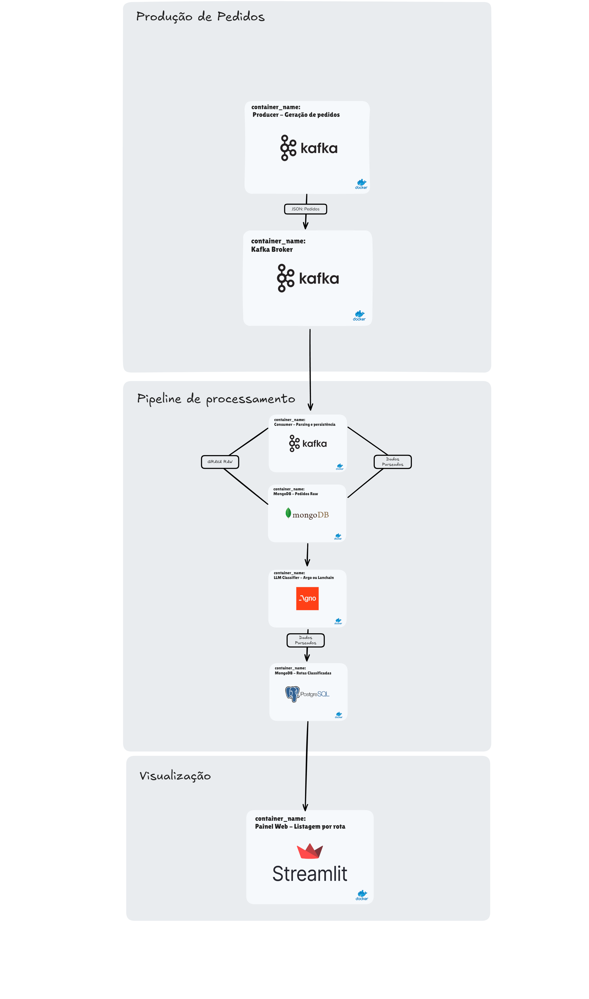

# UNIFOR - Projeto final - Data Pipeline Logistics

Projeto de demonstração de uma **pipeline de dados orientada a eventos** para simulação de pedidos de vendas. Utiliza **Apache Kafka** para mensageria, **MongoDB** como base de dados NoSQL, e um agente LLM (Agno) para **categorização e roteamento inteligente dos pedidos**. Um painel interativo com **Streamlit** permite a visualização das rotas definidas para entrega.

##  Tecnologias Utilizadas

- Docker & Docker Compose
- Apache Kafka + Zookeeper
- MongoDB
- Python 3.11
- Streamlit
- Agno (para processamento com LLM)

##  Arquitetura da Solução


- O **Producer** gera pedidos simulados e envia para o Kafka.
- O **Consumer** consome esses pedidos, faz parsing e grava no MongoDB.
- O **Agente LLM** classifica os pedidos com base em regras de negócio e os agrupa por rota.
- O **Streamlit Dashboard** exibe os pedidos agrupados por rota.

## Diagrama da arquitetura do projeto



Toda a comunicação entre os serviços acontece dentro de uma **rede Docker compartilhada**.


##  Estrutura do Projeto

```plaintext
data-pipeline-logistics/
├── compose.yml                     # Orquestração principal
├── docker/
│   └── docker-compose.yml         # Configuração alternativa/modular
├── consumers/                     # Consumo do Kafka e persistência no MongoDB
│   ├── Dockerfile
│   ├── order_consumer.py
│   └── requirements.txt
├── producers/                     # Geração contínua de pedidos simulados
│   ├── Dockerfile
│   ├── order_producer.py
│   ├── requirements.txt
│   └── pagseguro/
│       ├── gen_order.py
│       └── dataset/
│           ├── customers_llm.json
│           └── produtos_tech.py
├── llm/                           # Agente LLM de categorização de pedidos
│   ├── Dockerfile
│   ├── agente_categorizacao.py
│   ├── requirements.txt
│   └── prompts/
│       └── categorize.txt
├── streamlit_app.py               # Painel interativo de visualização
├── requirements.txt               # Requisitos gerais (opcional)
├── Makefile                       # Atalhos úteis para build e execução
├── logo.png                       # Logotipo do projeto
└── README.md                      # Este arquivo
```

##  Requisitos

- [Docker](https://www.docker.com/) e [Docker Compose](https://docs.docker.com/compose/)
- [Python 3.11+](https://www.python.org/) (caso deseje executar os scripts localmente)

##  Como Executar

1. **Suba os serviços principais com Docker Compose:**

```bash
docker compose up --build
```

Isso iniciará os seguintes containers:
- Kafka + Zookeeper
- MongoDB
- Producer (geração de pedidos)
- Consumer (gravação no MongoDB)

2. **Abra o painel de visualização com Streamlit:**

Em outro terminal:

```bash
streamlit run streamlit_app.py
```

3. **Execute o agente de categorização de pedidos (opcional):**

Esse agente acessa o MongoDB, agrupa os pedidos por **rota/estado**, e grava a saída categorizada:

```bash
python llm/agente_categorizacao.py
```


## Contribuidores
* [Felipe Soares](https://github.com/felipesoaresdev/)
* [Kandarpa Galas](https://github.com/kandarpagalas/) 
* [Winiston Freitas](https://github.com/winistonvf)

##  Licença

Este projeto é distribuído com o propósito de aprendizado e demonstração de arquitetura de pipelines de dados.  
**Uso em produção não é recomendado sem adaptações.**
